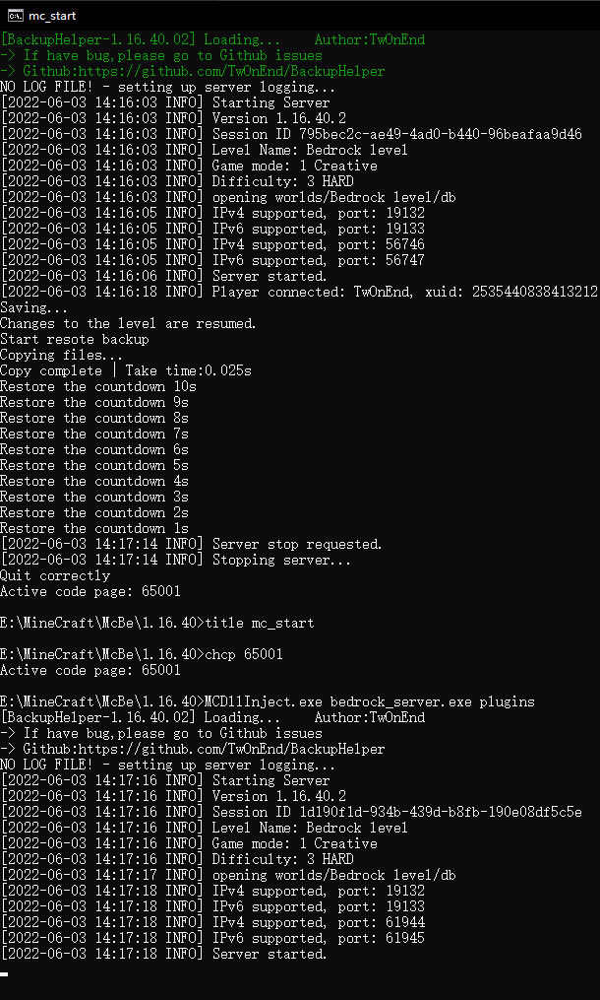

# BackupHelper
## **简体中文 | [English](README.md)**  
 
 
## 介绍
BackupHelper 是基于 [QuickBackupM](https://github.com/TISUnion/QuickBackupM) 开发的一个基岩版插件 
BackupHelper提供了较好的备份功能 , 它由以下基础功能组成: 
* 创建备份
* 删除备份
* 恢复备份
* 列出所有备份

后续可能会加入更完善的功能(如果我有时间的情况下)  
## 下载
你可以到[Releases](https://github.com/TwOnEnd/BackupHelper/releases)页面 , 下载最新的版本  
## 安装和使用
你需要使用到外置程序 [overwrite](https://github.com/TwOnEnd/overwrite) 
BackupHelper 是一个较特殊的插件 
因为有重启服务端的功能 , 所以无法通过GUI的DLL注入器进行加载 , 否则恢复备份完成后无法重启服务端 
但它可以在  [LiteLoaderBDS](https://github.com/LiteLDev/LiteLoaderBDS) 加载器或.bat上正常使用 
更多详细内容请到wiki  
## 交流与反馈
Github : [issues](https://github.com/TwOnEnd/BackupHelper/issues) 
QQ 群 : [745253558](https://jq.qq.com/?_wv=1027&k=SQT8C3Pu)  
## 代码来源与参考
* [hhhxiao - TrapDoor](https://github.com/hhhxiao/TrapDoor/) 
* [yqs112358 - BackupHelper](https://github.com/yqs112358/LLPlugins/tree/main/BackupHelper) 
* [zhkj-liuxiaohua - MCMODDLL-CPP](https://github.com/zhkj-liuxiaohua/MCMODDLL-CPP) 

感谢 [xiaoqch](https://github.com/xiaoqch) 的建议与疑难解答  

## 注意事项
* 在没有授权允许的情况下，你不能将其分发、传播、整合、出售！ 

未经允许，禁止转载 , 擅自整合转载或出售可能会使本插件停更！
  

## 后记
    从2020年二月末至今(2022-06-13)入坑基岩版已经两年多了

    期间做服主时非常想为自己服开发一个像样的插件,于是我从只会使用插件到想开发插件,最后到开发插件,
    经历了许多,对比当时也学习到了许多,这个插件或许可以证明

    虽然学到的只是皮毛,但我会继续去学习,做出更好的插件
    
    然而插件做出来,却不玩基岩版了(悲
